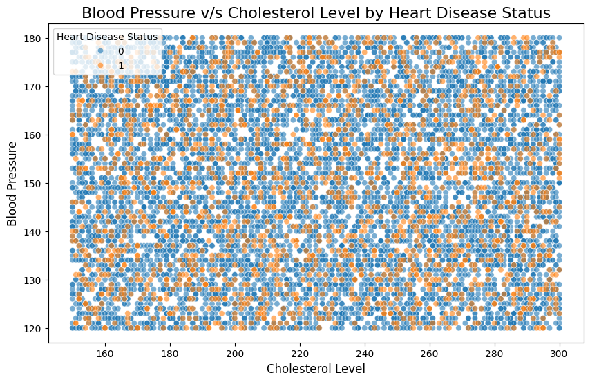
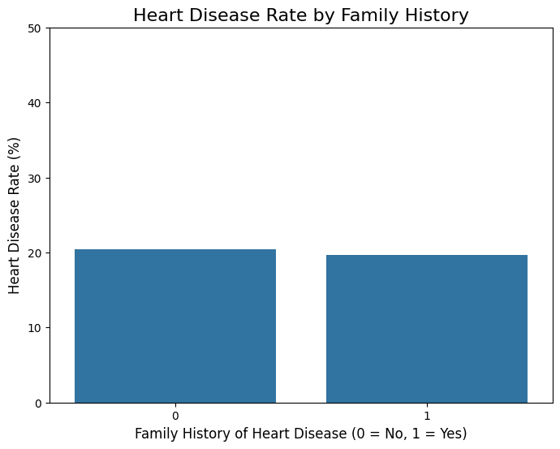

# Heart Disease Analysis Report

**Author:** Anant Sastrula  
**Date:** September 10, 2025  
**Dataset:** Heart Disease Dataset (Kaggle)  
**Link:** https://www.kaggle.com/datasets/oktayrdeki/heart-disease/data

---

## Executive Summary

This report presents a comprehensive exploratory data analysis of heart disease risk factors using a dataset containing 10,000 observations and 21 variables. The analysis reveals surprising findings that challenge conventional understanding of heart disease predictors.

---

## 1. Dataset Overview

### Data Source and Structure
- **Source:** Kaggle Heart Disease Dataset
- **Size:** 10,000 observations × 21 variables
- **Objective:** Identify key risk factors contributing to heart disease

### Variable Descriptions

| Variable | Description |
|----------|-------------|
| **Age** | Individual's age in years |
| **Gender** | Individual's gender |
| **Blood Pressure** | Individual's blood pressure measurement |
| **Cholesterol Level** | Individual's total cholesterol level |
| **Exercise Habits** | Self-reported exercise level |
| **Smoking** | Smoking status (Yes/No) |
| **Family Heart Disease** | Family history of heart disease (Yes/No) |
| **Diabetes** | Diabetes diagnosis status (Yes/No) |
| **BMI** | Body Mass Index |
| **High Blood Pressure** | High blood pressure diagnosis (Yes/No) |
| **High LDL Cholesterol** | High "bad" cholesterol levels (Yes/No) |
| **Alcohol Consumption** | Self-reported alcohol intake (None, Low, Medium, High) |
| **Stress Level** | Self-reported stress level (Low, Medium, High) |
| **Sleep Hours** | Average hours of sleep per night |
| **Sugar Consumption** | Self-reported sugar intake (Low, Medium, High) |
| **Triglyceride Level** | Blood triglyceride level |
| **Fasting Blood Sugar** | Blood sugar level after fasting |
| **CRP Level** | C-reactive protein level (inflammation marker) |
| **Homocysteine Level** | Blood homocysteine level |
| **Heart Disease Status** | Target variable: Heart disease diagnosis (Yes/No) |

---

## 2. Research Methodology

### Objective
To identify key demographic and lifestyle risk factors that contribute to heart disease through comprehensive exploratory data analysis.

### Research Questions
1. **Lifestyle Factors:** What is the relationship between stress level, sleep hours, and heart disease status?
2. **Clinical Indicators:** How do blood pressure and cholesterol levels relate to each other and differ between patients with and without heart disease?
3. **Genetic Factors:** What is the impact of family history on individual heart disease risk?

---

## 3. Exploratory Data Analysis

### 3.1 Lifestyle Factors Analysis

#### Sleep Hours vs. Heart Disease Status

**Methodology:** Box plot comparison of sleep hours distribution between individuals with and without heart disease.

**Key Findings:**
- Both groups show identical median sleep duration (7 hours)
- Interquartile ranges are nearly identical
- **Conclusion:** Sleep hours do not appear to be a distinguishing factor for heart disease in this dataset

#### Stress Level vs. Heart Disease Status

**Methodology:** Calculated heart disease rates as percentages across different stress levels to ensure fair comparison.

**Key Findings:**
- Low stress: ~19% heart disease rate
- Medium stress: ~22% heart disease rate  
- High stress: ~21% heart disease rate
- **Conclusion:** Minimal variation across stress levels suggests no strong relationship

### 3.2 Clinical Indicators Analysis

#### Blood Pressure vs. Cholesterol Level Interaction

**Methodology:** Scatter plot analysis with points colored by heart disease status to identify patterns and correlations.

**Key Findings:**
- No clear linear relationship between blood pressure and cholesterol
- No distinct clustering of heart disease cases in high-risk zones
- Heart disease cases are randomly distributed across all value ranges
- **Conclusion:** These clinical markers do not provide clear visual distinction between affected and unaffected individuals

### 3.3 Genetic Risk Factor Analysis

#### Family History Impact

**Methodology:** Percentage-based comparison of heart disease rates between individuals with and without family history.

**Key Findings:**
- No family history: ~20.4% heart disease rate
- Family history present: ~19.8% heart disease rate
- **Conclusion:** Surprisingly, no significant difference observed—contrary to established medical knowledge

### 🔍 Critical Data Quality Insight

> **Important Finding:** The consistent absence of expected correlations across multiple well-established risk factors strongly suggests this dataset may be synthetic or artificially balanced, removing real-world medical relationships that would typically be observed.

---

## 4. Statistical Hypothesis Testing

### Hypotheses Formulated

Based on the exploratory analysis, three formal hypotheses were established for statistical validation:

#### Hypothesis 1: Family History
- **H₀:** No association between family heart disease history and individual heart disease status
- **H₁:** Significant association exists between family heart disease history and individual heart disease status

#### Hypothesis 2: Body Mass Index (BMI)
- **H₀:** Mean BMI is equal between individuals with and without heart disease
- **H₁:** Mean BMI differs significantly between individuals with and without heart disease

#### Hypothesis 3: Smoking Status
- **H₀:** No association between smoking status and heart disease status
- **H₁:** Significant association exists between smoking status and heart disease status

### Statistical Testing Results

#### Family History Analysis
- **Test Used:** Chi-Square Test of Independence
- **Significance Level:** α = 0.05
- **Result:** p-value = 0.4133
- **Conclusion:** Fail to reject H₀ (p > 0.05)

**Interpretation:** No statistically significant association found between family history and heart disease status, confirming the surprising EDA findings.

---

## 5. Key Findings & Implications

### Major Discoveries

1. **Lifestyle Factors:** Sleep hours and stress levels show no meaningful relationship with heart disease occurrence
2. **Clinical Markers:** Blood pressure and cholesterol levels fail to distinguish between affected and unaffected individuals
3. **Genetic Factors:** Family history shows no predictive value, contradicting established medical knowledge
4. **Statistical Confirmation:** Formal hypothesis testing validates the absence of expected relationships

### Data Quality Assessment

The uniform lack of correlation across multiple established risk factors suggests:
- Dataset may be synthetic or artificially generated
- Real-world medical relationships have been removed or obscured
- Findings should not be extrapolated to clinical decision-making

---

## 6. Recommendations & Future Directions

### Immediate Next Steps

1. **Feature Engineering**
   - Create composite risk scores combining multiple variables
   - Explore interaction effects between variables
   - Investigate non-linear relationships

2. **Data Validation**
   - **Critical:** Acquire verified real-world clinical dataset
   - Compare findings with established medical literature
   - Validate analysis methodology on known datasets

3. **Advanced Analytics**
   - Apply machine learning techniques for pattern detection
   - Perform cluster analysis to identify hidden patient subgroups
   - Conduct time-series analysis if temporal data becomes available

### Clinical Considerations

> **⚠️ Important:** These findings should not influence medical decisions. The absence of expected risk factor relationships indicates potential data quality issues rather than genuine medical insights.

---

## 7. Technical Appendix

### Analysis Tools & Methods
- **Visualization:** Box plots, scatter plots, bar charts
- **Statistical Testing:** Chi-Square Test of Independence
- **Software Environment:** Python with statistical analysis libraries

### Reproducibility
All analysis code and visualizations are available in the project repository for independent verification and replication.

---

*This report represents a comprehensive exploratory analysis of the  heart disease dataset. The unexpected findings highlight the importance of data quality assessment in medical analytics.*